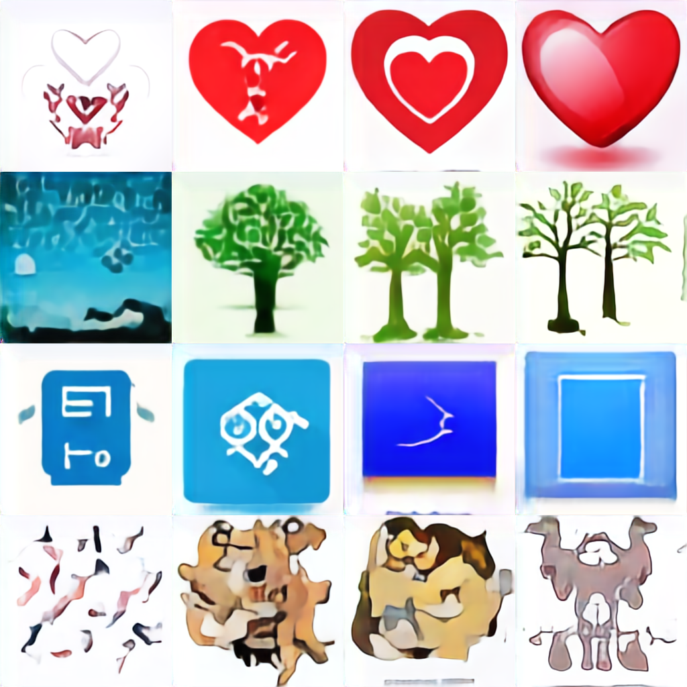

# HCText2Image

Train a toy autoregressive image generator and a VQ encoder/decoder.

I ran this for a few weeks on my [laion-icons](https://github.com/unixpickle/laion-icons) dataset.
It does learn *something*&mdash;it clearly understands something about colors and basic shapes,
as shown by the few cases where the model actually follows the prompt.
However, for most prompts, the samples are pretty much garbage.

For a big dump of samples, see [this page](https://data.aqnichol.com/hctext2image/samples/).

Here are some samples for the following prompts, sweeping guidance scales 1, 2, 4, and 8:

 1. a red heart icon, red heart vector graphic
 2. a green tree, a tree with green leaves
 3. A blue square. A simple blue square icon.
 4. a cute corgi vector graphic. corgi dog graphic



For most complex prompts, the model just totally fails in my experience. I'd expect it to need a lot more compute
before we end up with anything particularly useful.

# Data and pretrained models

 * Pre-trained VQ encoder and decoder: [download here (26 MiB)](https://data.aqnichol.com/hctext2image/vqmodel_ssim_high.plist)
 * Pre-trained 24-layer generative model: [download here (898 MiB)](https://data.aqnichol.com/hctext2image/transformer_75e-5_d24_bs8.plist)
 * Pre-tokenized laion-icons dataset: [download here (7.7 GiB)](https://data.aqnichol.com/hctext2image/vqs.tar.gz)

# Using the model yourself

After downloading the above model checkpoints, you can run a local server for generating images.

```shell
$ swift run -c release HCText2Image server vqmodel_ssim_high.plist transformer_75e-5_d24_bs8.plist <port>
```

This will listen on `http://localhost:<port>`. You can load it in your browser to enter a prompt and sample an image.
